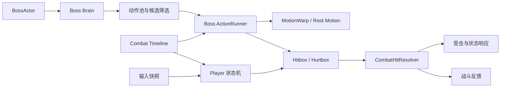

# Project EVE Demo

> 基于 Unity 开发的第三人称 3D 动作战斗 Demo，参考《剑星》Raven Boss 战进行玩法复刻与系统实现，作为 Unity 游戏客户端开发求职作品。

## 演示视频

### [▶ 在哔哩哔哩观看完整演示](https://www.bilibili.com/video/BV15xeA6QExu/)

视频展示了玩家移动与锁定、轻重攻击、闪避与完美闪避、防御与完美防御、技能、受击反应，以及多阶段 Boss AI、动作位移和战斗反馈等核心内容。

## 项目简介

本项目设计完全由个人独立完成。同时借助了AI Agent (Chatgpt+Unity-Skill/MCP) 辅助编程，但对AI生成的代码能够完全负责。

项目重点不是开放世界或内容量，而是完整呈现一场可交互的 Boss 战，并展示以下客户端开发能力：

- 玩家动作状态机与输入缓存
- 数据驱动的攻击、技能、防御、闪避和受击流程
- Boss 分层决策、动作池与阶段行为
- Hitbox / Hurtbox、伤害结算与命中去重
- Root Motion、Motion Warping 与代码位移
- HitStop、CameraShake与受击特效反馈
- 自定义 Combat Timeline 编辑工具与 Unity Test Framework 测试

## 核心系统

### 玩家战斗

- 第三人称移动、自由视角与锁定视角
- Light / Heavy 连段和输入缓存
- Evade / Perfect Evade
- Guard / Perfect Guard
- Skill、HitReaction、Knockdown、Dead
- 基于时间窗口的连段、输入缓存、取消后摇等

### Boss AI

- `BossActor` 作为Boss控制入口，负责状态转移、招式决策、位移、攻击命中和受击反应
- 按近战、追击、特殊、远程和受击脱离等玩法语义划分动作池
- 根据距离、阶段、冷却、空间条件、战斗压力和玩家行为过滤候选动作
- 在有效候选中进行加权选择，兼顾行为合理性与不可预测性
- 支持阶段权重、重复限制、连续受击限制和强制阶段动作

### Combat Timeline

- 使用强类型 Timeline 资产描述动作阶段和能力窗口
- 统一配置 HitNode、Cancel、Defense、Armor、Motion、Reaction Gate 等时间数据
- 运行时由数据提供类`CombatTimelineProvider`统一控制数据读取，转换为业务逻辑需要的直接数据，状态机不需要重复遍历编辑器 Clip
- 自定义编辑器支持动作数据编辑和预览

### 动作位移

- `BossMotionWarpProfile` 集中维护每个动作的出招空间和位移参数
- 支持 Root Motion 缩放/方向修正、代码突进、后撤、环绕和朝向修正
- 使用时间窗口限制位移生效区间，并通过停靠距离、死区、速度和角速度控制落点
- 出招前执行距离与空间预筛选

### 战斗判定与反馈

- Player 与 Boss 共用通用战斗数据、Hurtbox 和命中解析流程
- 以 `AttackInstanceId + HitNodeId + Target` 为粒度进行命中去重
- HitNode 显式描述伤害、受击类型以及是否允许防御、完美防御和完美闪避
- 战斗结算与表现解耦，反馈层负责 HitStop、CameraShake和短时慢动作

## 架构概览

## 代码导航

| 模块 | 主要职责 |
| --- | --- |
| [`Assets/Runtime/Player`](Assets/Runtime/Player) | 玩家状态机、移动、动画、攻击和受击 |
| [`Assets/Runtime/Boss`](Assets/Runtime/Boss) | Boss Actor、Brain、动作选择、执行、位移和反应 |
| [`Assets/Runtime/Combat`](Assets/Runtime/Combat) | 通用战斗数据、命中解析、资源与 Timeline 运行时 |
| [`Assets/Runtime/Combat/Timeline`](Assets/Runtime/Combat/Timeline) | 强类型动作 Timeline 资产 |
| [`Assets/Editor/ProjectEVE/CombatTimeline`](Assets/Editor/ProjectEVE/CombatTimeline) | Combat Timeline 自定义编辑器 |
| [`Assets/Runtime/Camera`](Assets/Runtime/Camera) | 自由/锁定相机、位移跟随与 CameraShake |
| [`Assets/Runtime/Feedback`](Assets/Runtime/Feedback) | HitStop、慢动作、命中反馈 |
| [`Assets/Tests`](Assets/Tests) | EditMode 与 PlayMode 自动化测试 |

## 技术栈

- Unity `6000.3.15f1`
- C#
- Universal Render Pipeline（URP）
- Unity Input System
- Animator / Root Motion
- ScriptableObject 数据配置
- Unity Test Framework

## 仓库说明

这是用于求职展示的代码仓库。角色模型、动画、音频、贴图及部分第三方资源因版权和授权限制未上传，因此克隆仓库后不能保证直接还原演示视频中的完整画面和运行环境。通过顶部演示视频了解最终效果，

## 项目范围

本项目聚焦单场 Boss 战斗体验，不包含开放世界、背包、任务、对话、商店或复杂的非战斗系统。集中展示动作游戏客户端的核心开发能力。

## 版权说明

本项目仅用于个人学习、技术研究和求职展示，《剑星》相关名称、角色形象及原作内容的权利归原权利方所有；公开仓库不提供相关第三方美术资源。
